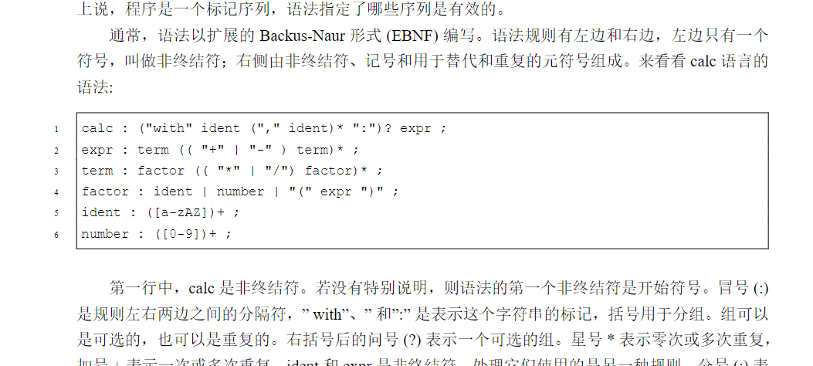
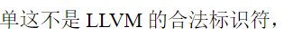
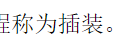
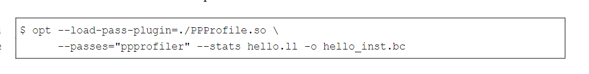
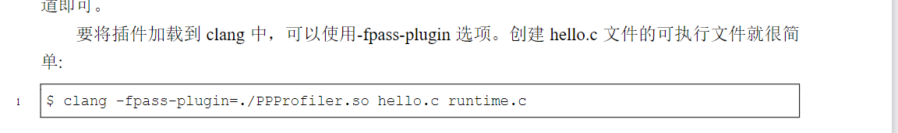
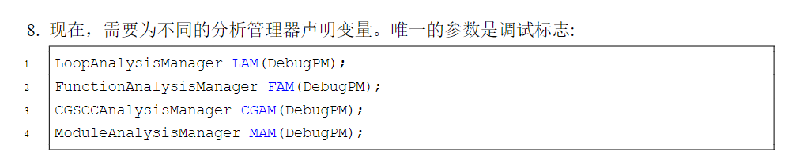

# 2.2 `ident : ([a-zAZ])+ ;` 错误

应该为
```bash
ident : ([a-zA-Z])+ ;
```
# 2.3 `Token::Token::l_paren` 错误


应该为
```c++
else 
{
    switch (*buffer_ptr) {
        #define CASE(ch, tok) \
        case ch: from_token(token, buffer_ptr + 1, tok); break
        CASE('+', Token::plus);
        CASE('-', Token::minus);
        CASE('*', Token::star);
        CASE('/', Token::slash);
        CASE('(', Token::l_paren);
        CASE(')', Token::r_paren);
        CASE(':', Token::colon);
        CASE(',', Token::comma);
        #undef CASE
        default: from_token(token, buffer_ptr + 1, Token::unknown);
    }
    return;
}
```

# 2.6 CMakeLists.txt 中需要加一句，否则运行 `ninja` 时会报错


```bash
# 添加编译选项 -fno-rtti，该选项用于禁用 C++ 的运行时类型信息（RTTI）
add_compile_options(-fno-rtti) 
```
在随书代码中给出的程序无误: `https://github.com/PacktPublishing/Learn-LLVM-17`

# 2.6 llc -o 使用有误，`–o=expr.o`会报错，应该为`-o expr.o`


```bash
./build/src/calc "with a: a*3" | llc -filetype=obj -relocation-model=pic -o expr.o
```

# 3.4 nunErrors 拼错了


# 3.6 突然发现书中并没有将代码都写全，而是写在了随书代码中，之后书略看、跳着看，重点放在了理解代码上
随书代码: `https://github.com/PacktPublishing/Learn-LLVM-17`

# 4.2.8

错字 `单` -> `但` 无伤大雅

# 7.3

错字 `插装` -> `插桩` 无伤大雅

# 7.4

一是文件名写错 PPProfile.so -> PPProfiler.so, 而是安装后应该为 `--load-pass-plugin=PPProfiler.so`

同样的错误:


# 7.5 

有些代码书中的不对, 书无法轻易改, 但是 github 上的代码是正确的, 会有细微的差别注意辨别, 例如上边这块。