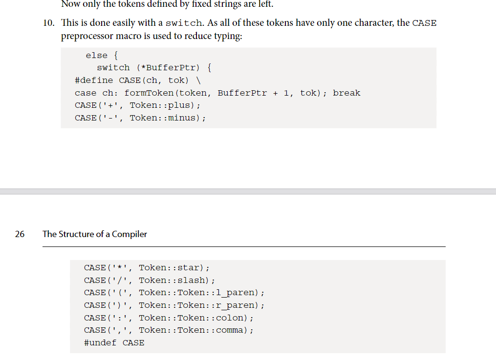

# 2.3 `Token::Token::l_paren` 错误



```c++
else 
{
    switch (*buffer_ptr) {
        #define CASE(ch, tok) \
        case ch: from_token(token, buffer_ptr + 1, tok); break
        CASE('+', Token::plus);
        CASE('-', Token::minus);
        CASE('*', Token::star);
        CASE('/', Token::slash);
        CASE('(', Token::l_paren);
        CASE(')', Token::r_paren);
        CASE(':', Token::colon);
        CASE(',', Token::comma);
        #undef CASE
        default: from_token(token, buffer_ptr + 1, Token::unknown);
    }
    return;
}
```

# 2.6 CMakeLists.txt 中需要加一句，否则运行 `ninja` 时会报错


```bash
# 添加编译选项 -fno-rtti，该选项用于禁用 C++ 的运行时类型信息（RTTI），可以减少生成的二进制文件大小并提高性能[^11^]。
add_compile_options(-fno-rtti) 
```

# 2.6 llc -o 使用有误，`–o=expr.o`会报错，应该为`-o expr.o`


```bash
./build/src/calc "with a: a*3" | llc -filetype=obj -relocation-model=pic -o expr.o
```